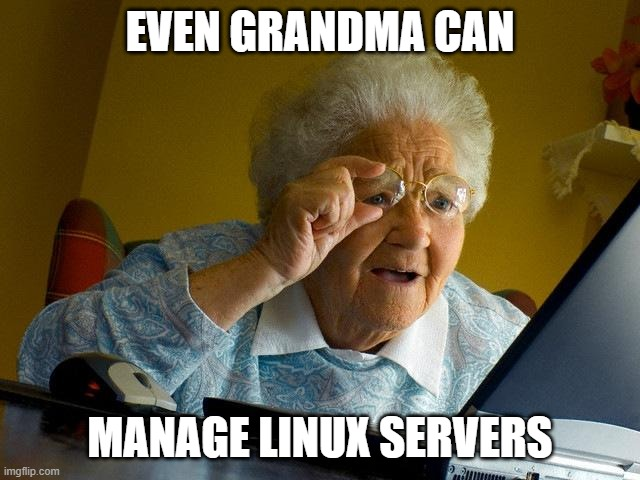

Lo complejo de una tarea está en el conocimiento y esfuerzo que nos toma completarla. En este post, les comento sobre una herramienta que puede ayudar a los menos expertos o perezosos a administrar equipos Linux con un menor esfuerzo o bien, no requerir de tantos conocimientos técnicos. 

# Cattle, no pets!

Cockpit es una herramienta que te permite mediante plugins llamados “aplicaciones”, la administración remota, asistida y con interface gráfica de sistemas Linux. 

Esto es muy útil si, por ejemplo, no estás muy familiarizados con sistemas Linux, vienes de un mundo Windows, o bien, no eres muy amante de las terminales y los comandos.  

## E

## A

## C

## A

## E

# Conclusión

