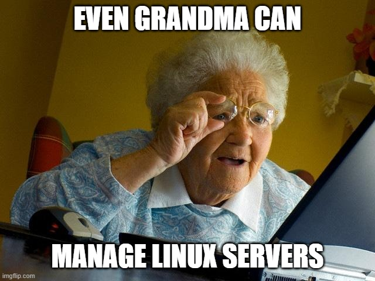

Lo complejo de una tarea está en el conocimiento y esfuerzo que nos toma completarla. En este post, les comento sobre una herramienta que puede ayudar a los menos expertos o perezosos a administrar equipos Linux con un menor esfuerzo o bien, no requerir de tantos conocimientos técnicos. 

# Cockpit Project

Cockpit es una herramienta que te permite mediante plugins llamados “aplicaciones”, la administración remota, asistida y con interface gráfica de sistemas Linux. 

Esto es muy útil si, por ejemplo, no estás muy familiarizados con sistemas Linux, vienes de un mundo Windows, o bien, no eres muy amante de las terminales y los comandos.  

## ¿Qué puedo administrar con Cockpit? 

Es una herramienta web (la puedes utilizar desde el navegador web de tu preferencia) , esta viene con una lista de plugins que te permitirán administrar diferentes opciones de su sistema Linux, por defecto no vienen instalados, pues la necesidad de administración dependerá de cada uno de nosotros y el uso que le demos a nuestros sistemas, pero algunos ejemplos de opciones que puedes administrar son 

• Reportes de diagnóstico 

• Constructor de imágenes de sistema operativo 

• Recolección de logs del kernel 

• Administración de máquinas virtuales dentro de la máquina que administramos 

• Grabación de sesiones 

• Administración de almacenamiento 

Adicional sin necesidad de plugins, puedes administrar redes, servicios, cuentas de usuario, logs, actualizaciones y acceder de forma muy amigable a una terminal embebida en la aplicación 

## ¿Cómo se instala Cockpit? 

Bien, lo primero (por si aún no estás muy familiarizado) Linux es un kernel (núcleo del sistema operativo), del cual existen muchas distribuciones (conjuntos de aplicaciones, que forman el sistema operativo como lo conocemos), cada una de estas tiene variantes, por lo que ejecutar tareas como la instalación de un aplicativo, puede variar de una distribución a otra. 

Para ayudarte te voy a colocar las instrucciones de instalación para algunas distribuciones más comunes 

### Fedora

Paso 1: Instalar la herramienta 

sudo dnf install cockpit 

Paso 2: Habilitar la aplicación para que siempre esté activa 

sudo systemctl enable --now cockpit.socket 

Paso 3: Configurar el firewall para permitir el acceso remoto 

sudo firewall-cmd --add-service=cockpit 

sudo firewall-cmd --add-service=cockpit --permanent 

## E

## A

## C

## A

## E

# Conclusión

